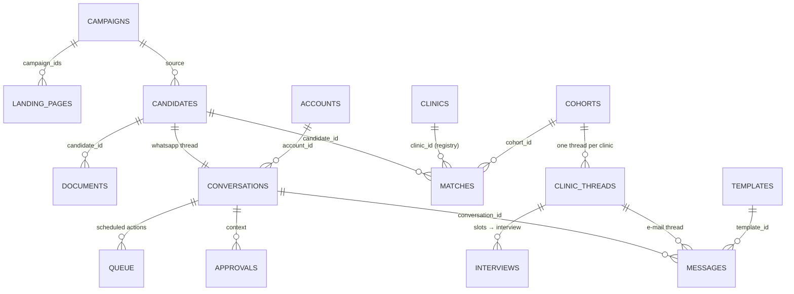

# Autopilot — candidate funnel, matching, clinic outreach

**What:** the operator console for the recruiting side of the business: nurses arrive on WhatsApp (from Meta ads and landing pages), Luna (the agent) qualifies them and collects their documents, we match them against the clinics in the registry, send anonymised profiles (singly or as a cohort), and drive interview scheduling with the clinics by e-mail — with automatic follow-ups, human approvals where the risk is real, and a pause/stop switch on every conversation.
**Route:** `/autopilot` (console) · **Dock:** the same inbox as a side panel on `/` and `/pro` (`/dock.js`).
**Status:** proof of concept on synthetic data. Nothing here sends a real WhatsApp message or e-mail; the "accounts" are an inventory, the engine is a deterministic simulation with a virtual clock (`POST /api/autopilot/tick` advances it).

## Why these features, in this order

The business is a pipeline with humans on both ends. What breaks such pipelines at scale is not the messaging, it is the bookkeeping: who owes whom the next move, by when, what is still missing, and what the agent may do alone. The console is built around those four questions.

1. **Conversation state is explicit and machine-readable.** Every thread carries a `state` (where in the script Luna is), a `next_actor` (`us` / `candidate` / `clinic`), an `sla_due_at`, and a `checklist` (which of CV, education certificate, Anerkennung, language certificate, location are collected, missing or unclear). The filters everyone actually uses — *Antwort nötig*, *Warten auf Kandidatin*, *Überfällig* — are derived from these fields, not from tags typed by hand.
2. **Mode per conversation with clear semantics.** `luna` (autopilot), `paused` (Luna holds, nothing goes out), `human` (an operator took over; Luna only drafts), `manager` (escalated; needs a decision), `stopped` (opt-out, DSGVO deletion, blacklist — never message again). Every transition is logged with actor and reason; bulk transitions exist (pause everything from campaign X).
3. **Funnel with conversion, time-in-stage and leak reasons,** grouped by source campaign, language, region or owner. This is what closes the loop to the ad spend: cost per qualified nurse, per interview, per placement.
4. **Human approvals by risk tier, plus a global autopilot mode.** `off` = humans send everything; `assist` = Luna drafts, humans send; `auto` = Luna sends low-risk messages alone, medium-risk actions (sending a profile, proposing interview slots, a cohort send) wait in the approval queue, high-risk topics (salary, visa/legal, a candidate asking for a human, anything outbound to a new clinic contact) always escalate. "Approve and remember" turns a decision into a policy rule.
5. **Matching and cohorts against the real registry.** Candidates are scored against the 407 registry sites and their open postings (role class, department, region and radius, qualification, language level, Anerkennung status, shift and start preferences). A cohort is a cluster of similar candidates sent as one anonymised bundle to a set of clinics, with per-(candidate, clinic) outcomes tracked and two throttles: at most N concurrent profiles per candidate, at most M profiles per clinic per week.
6. **Clinic threads are their own state machine** (intro → awaiting reply → interested → scheduling → scheduled → feedback → closed), with a follow-up cadence (3, 7, 14 business days, then stop), slot negotiation (we propose three, the clinic picks or counters, we confirm to the candidate, reminders 24 h and 2 h before), interview rounds, and post-interview feedback requests.
7. **Queue (Warteschlange).** Everything scheduled — follow-ups, document reminders, interview reminders, cohort sends — is a row with a due time, a reason and a cancel / run-now / snooze control. Automation you cannot see is automation you cannot trust.
8. **Accounts and APIs as an inventory with health.** WhatsApp numbers (connection, quality rating, daily cap and usage, warm-up stage), mailboxes (SMTP/IMAP, bounce rate, DMARC), and the APIs (Meta Marketing, WhatsApp Cloud, e-mail provider, calendar, LLM, Exa, Firecrawl) with quota and last error. Routing rules say which number talks to which campaign or language.
9. **Templates** per channel, language and stage, with variables, versions and reply rate; Luna picks the template from (stage, language, missing field).
10. **Meta ads and landing pages.** Campaigns → ad sets → ads with spend, impressions, clicks, leads, CPL; landing pages with A/B variants and conversion; click-to-WhatsApp deep links carry a `ref` so the first inbound message attributes the candidate to the campaign. Alerts (CPL spike, landing-page conversion drop, WhatsApp quality drop) propose a pause.
11. **Audit and compliance.** Every automated send is an event; consent is captured before data collection; "STOP" is honoured; anonymised profiles strip name, phone and photo (initials + qualifications + experience + availability only).

## Data model (SQLite, `data/autopilot.sqlite`, regenerable)

| table | key fields |
|---|---|
| `candidates` | id, name, initials, phone (synthetic, shown masked), language, german_level, origin_country, city, plz, region, radius_km, role_class, departments[], qualification, experience_years, anerkennung_status (`none`/`applied`/`deficit_notice`/`granted`/`not_needed`), work_permit, employment_type, shifts[], start_from, source_campaign_id, landing_page_id, consent_at, stage, stage_changed_at, lost_reason, owner, tags[], created_at |
| `documents` | id, candidate_id, kind (`cv`/`education_cert`/`anerkennung`/`language_cert`/`work_permit`/`references`), status (`missing`/`requested`/`received`/`verified`/`rejected`), received_at, note |
| `conversations` | id, kind (`candidate`/`clinic`), candidate_id, clinic_thread_id, channel (`whatsapp`/`email`), account_id, mode (`luna`/`paused`/`human`/`manager`/`stopped`), state, next_actor (`us`/`candidate`/`clinic`/`none`), sla_due_at, unread, last_message_at, last_preview, language, tags[], pause_reason, opened_at, closed_at |
| `messages` | id, conversation_id, dir (`in`/`out`), author (`candidate`/`clinic`/`luna`/`operator`/`system`), text, at, status (`received`/`queued`/`pending_approval`/`sent`/`delivered`/`read`/`failed`), template_id, attachments[], meta (extracted fields) |
| `clinic_threads` | id, clinic_id (registry KeZ), clinic_name, contact_name, contact_email, mailbox_id, cohort_id, state (`draft`/`intro_sent`/`awaiting_reply`/`interested`/`scheduling`/`scheduled`/`feedback_pending`/`closed_won`/`closed_lost`/`no_response`), followup_attempt, followup_max, next_followup_at, candidate_ids[], proposed_slots[], agreed_slot, round, last_at |
| `matches` | id, candidate_id, clinic_id, posting_id, score, reasons[], status (`proposed`/`approved`/`sent`/`clinic_interested`/`interview`/`declined_by_clinic`/`declined_by_candidate`/`placed`), cohort_id, created_at |
| `cohorts` | id, name, criteria, candidate_ids[], clinic_ids[], status (`draft`/`pending_approval`/`sent`/`in_progress`/`done`), created_at, sent_at |
| `interviews` | id, candidate_id, clinic_id, clinic_thread_id, at, format (`phone`/`video`/`onsite`), round, status (`proposed`/`confirmed`/`reminded`/`done`/`no_show`/`cancelled`), feedback |
| `approvals` | id, kind (`message`/`match_send`/`cohort_send`/`escalation`/`stage_change`/`campaign_change`), risk (`low`/`medium`/`high`), reason, context (conversation_id, candidate_id, clinic_thread_id, cohort_id, campaign_id), draft, status (`pending`/`approved`/`rejected`/`edited`/`expired`), created_at, decided_at, decided_by, remember |
| `queue` | id, due_at, kind (`follow_up_candidate`/`follow_up_clinic`/`doc_reminder`/`interview_reminder`/`feedback_request`/`cohort_send`/`campaign_check`/`nurture`), target, reason, status (`scheduled`/`running`/`done`/`cancelled`/`failed`), attempt, created_by, result |
| `templates` | id, channel, lang, stage, name, subject, body, variables[], version, uses, reply_rate, active |
| `accounts` | id, kind (`whatsapp`/`mailbox`/`api`), name, identifier, provider, status (`connected`/`degraded`/`disconnected`/`rate_limited`), quality (`green`/`yellow`/`red`), daily_cap, used_today, warmup_stage, last_error, last_ok_at, routing |
| `campaigns` | id, name, platform, objective, status (`active`/`paused`/`learning`/`ended`), daily_budget, spend_total, spend_7d, impressions, clicks, leads, qualified, interviews, placed, adsets[], ads[] |
| `landing_pages` | id, slug, url, title, language, campaign_ids[], variants[{key, headline, cta, form_fields[], visits, leads, winner}], wa_deeplink, status |
| `events` | id, at, actor, kind, target, detail — the audit timeline |
| `policy` | singleton: mode, quiet_hours, tz, max_msgs_per_candidate_per_day, cadence_candidate[], cadence_clinic[], max_concurrent_profiles_per_candidate, max_profiles_per_clinic_per_week, risk_rules{low, medium, high}, escalation_triggers[], auto_pause_on[], sim_now |

Candidate funnel stages, in order: `new` → `contacted` → `qualifying` → `docs_pending` → `qualified` → `matching` → `profile_sent` → `interview_scheduling` → `interview_scheduled` → `interviewed` → `offer` → `placed`; side exits `lost` (with `lost_reason`) and `dormant`.

Candidate conversation states, in order (what Luna is doing): `greeting` → `consent` → `collect_basics` → `collect_location` → `collect_docs` → `docs_review` → `qualified` → `matching` → `profile_sent` → `interview_prep` → `awaiting_feedback` → `placed` | `lost` | `dormant`.

## The engine (deterministic simulation)

`app/autopilot/engine.py` is rule based; there is no LLM in the loop for the PoC (the gateway has no credits, and a demo should be reproducible). It has three entry points:

- `next_action(conversation)` → `{action, template_id, risk, text}`: from `state`, the checklist and the policy, what Luna would do next.
- `apply_inbound(conversation, text, attachments)`: extracts fields (city, PLZ, German level, years, document kinds) with regexes, advances the state, sets `next_actor=us`, and checks the escalation triggers (salary, visa/legal, "Mensch"/"human", complaint words, "STOP").
- `tick(minutes)`: advances the virtual clock `policy.sim_now`; runs due queue rows (a follow-up becomes a message, or an approval when the policy says so); simulates inbound replies for a share of conversations whose `next_actor` is `candidate` or `clinic` from a scripted, state-specific reply corpus; lets campaigns spend and generate the odd new lead; returns the list of events so the UI can show what happened.

The seed (`python -m app.autopilot.seed --reset`) is anchored at a fixed virtual date and uses a fixed RNG seed, so two machines produce the same demo. Candidate names, phone numbers and e-mails are invented; clinic names, towns and open postings are the real registry.

## API contract (`/api/autopilot/*`)

All responses are JSON. List endpoints accept `limit`/`offset` and return `{total, rows}`. Times are ISO-8601 in Europe/Berlin. Errors are `{error}` with an HTTP status.

| method · path | body / query | returns |
|---|---|---|
| `GET /overview` | – | `{sim_now, mode, counts:{needs_reply, waiting_candidate, waiting_clinic, manager, paused, luna_active, approvals_pending, queue_due, overdue}, funnel:[{stage, count}], accounts:[{id, kind, name, status, quality, used_today, daily_cap}], alerts:[{level, text, link}], recent_events:[…]}` |
| `GET /conversations` | `kind, channel, mode, next_actor, state, stage, campaign_id, lang, owner, q, view (needs_reply|manager|paused|luna|clinics|overdue), sort, limit, offset` | `{total, rows:[{id, kind, channel, name, initials, avatar_color, phone_masked, email, last_preview, last_at, unread, mode, state, next_actor, sla_due_at, overdue, stage, tags, language, campaign_id, clinic_id}]}` |
| `GET /conversations/{id}` | – | `{conversation, messages:[…], candidate?, clinic_thread?, checklist:[{field, label, status, value}], suggestion:{action, label, template_id, risk, text}, matches:[…top 5], timeline:[{at, actor, kind, detail}]}` |
| `POST /conversations/{id}/mode` | `{mode, reason}` | updated conversation |
| `POST /conversations/{id}/send` | `{text, template_id?, as: "operator"|"luna"}` | the message (status `sent` or `pending_approval` with `approval_id`) |
| `POST /conversations/{id}/action` | `{action: "suggest"|"request_doc"|"propose_matches"|"follow_up_now"|"snooze"|"mark_read"|"share_posting", params}` | `{ok, result}` (`share_posting` takes `posting_id` or `clinic_id` and sends the job to the candidate) |
| `POST /conversations/bulk` | `{ids[] or filter, mode, reason}` | `{updated}` |
| `GET /candidates` | `stage, q, region, role_class, language, anerkennung, campaign_id, limit, offset` | `{total, rows:[candidate + {checklist_ok, checklist_total, matches, conversation_id}]}` |
| `GET /candidates/{id}` | – | `{candidate, documents, checklist, matches, cohorts, interviews, conversation_id, timeline}` |
| `POST /candidates/{id}/stage` | `{stage, reason}` | updated candidate |
| `GET /funnel` | `by: source|language|region|owner` | `{stages:[{stage, count, conversion_from_prev, median_days}], groups:[{key, stages:[…]}], leaks:[{reason, count}], baseline:{…}}` |
| `GET /matches` | `candidate_id or clinic_id, status` | `{rows:[{id, candidate:{id, initials, role_class, german_level}, clinic:{clinic_id, name, town}, posting:{posting_id, title}?, score, reasons, status, cohort_id}]}` |
| `POST /matches/{id}/status` | `{status}` | updated match (a `sent` request obeys the risk policy and may return an approval) |
| `GET /cohorts` · `GET /cohorts/{id}` | – | list / detail with members, clinics, threads, outcomes |
| `POST /cohorts/preview` | `{criteria:{role_class, region, qualification, german_level_min, anerkennung, departments[]}}` | `{candidates:[…], clinics:[{clinic_id, name, town, open_postings, score}], bundle_preview:{subject, body}}` |
| `POST /cohorts` | `{name, criteria, candidate_ids, clinic_ids}` | the cohort (`draft`) |
| `POST /cohorts/{id}/send` | – | `{status, approval_id?, threads_created}` |
| `GET /clinic-threads` · `GET /clinic-threads/{id}` | `state, clinic_id, cohort_id` | list / detail with messages, negotiation, interviews |
| `POST /clinic-threads/{id}/action` | `{action: "follow_up_now"|"propose_slots"|"confirm_slot"|"counter_slot"|"request_feedback"|"close", params}` | `{ok, thread}` |
| `GET /interviews` | `status, from, to` | `{rows}` |
| `GET /approvals` | `status=pending, risk, kind` | `{rows}` |
| `POST /approvals/{id}` | `{decision: "approve"|"reject"|"edit", text?, remember?}` | `{approval, effect}` |
| `POST /approvals/bulk` | `{decision, risk: "low"}` | `{decided}` |
| `GET /queue` | `status, kind, due_before` | `{rows}` |
| `POST /queue/{id}` | `{action: "run_now"|"cancel"|"snooze", minutes?}` | updated row |
| `GET /policy` · `PUT /policy` | policy object | policy |
| `POST /tick` | `{minutes: 60}` | `{sim_now, events:[…], summary:{messages_out, messages_in, approvals_created, queue_run, leads_new}}` |
| `GET /campaigns` | – | `{campaigns:[…with adsets, ads, cpl, cpq, cpp], landing_pages:[…], attribution:[{campaign_id, stages:{…}, cost_per:{…}}], alerts:[…]}` |
| `POST /campaigns/{id}` | `{action: "pause"|"resume"|"budget", daily_budget?}` | campaign (obeys risk policy: budget changes above +50 % need approval) |
| `POST /landing-pages/{id}` | `{action: "set_winner"|"toggle", variant}` | landing page |
| `GET /templates` · `PUT /templates/{id}` | `channel, lang, stage` | list / updated template (version bump) |
| `GET /accounts` | – | `{whatsapp:[…], mailboxes:[…], apis:[…], routing:[…]}` |
| `POST /seed/reset` | – | `{ok, counts}` — rebuild the synthetic dataset |

## The dock (`/dock.js`, `/dock.css`)

A self-contained script both job-board pages include. It renders a pill (`Chats · N` where N = threads that need a reply) and a panel that can be docked left, right or bottom, minimised, or hidden; the choice persists in `localStorage`. It inherits the host page's tokens (`--bg`, `--surface`, `--ink`, `--line`, `--neon`, `--red`, and `--accent` on the light page or `--blue` on the dark one), so it is light on `/` and dark on `/pro` without its own theme code. It shows the same inbox as the console (tabs *Alle · Antwort · Manager · Pausiert*, list, thread, composer, mode buttons) and one thing the console cannot: context. On `#/clinic/:id` or `#/job/:id` it offers "send this to …" with a candidate picker, and shows how many qualified candidates match that clinic.

## Known limits of the PoC

- No real channel is wired: WhatsApp Cloud API, mailboxes and Meta Marketing API appear as inventory rows with synthetic health. `POST /tick` is the only thing that makes time pass.
- Field extraction is regex based; the production version puts an LLM behind `LLM_API_BASE` in `apply_inbound()` and `next_action()` and keeps the same state machine.
- The matching score is a transparent weighted sum (role class 30, region/radius 25, qualification 15, department 10, German level 10, Anerkennung 10); it is meant to be read, not to be clever.
