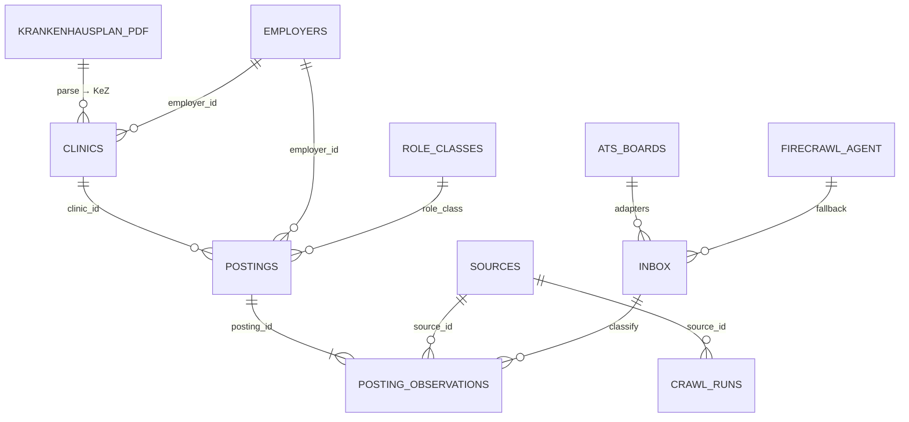

# Überblick & Ontologie

**What:** every open, experienced-level nursing job at every hospital site in the Bavarian *Krankenhausplan*, with the evidence for each row.
**Live:** https://pflege-board.exe.xyz · **Read API:** PostgREST schema `pflege_jobs` · **App API:** `/api/*` (see [api.md](api.md)).

The interactive graph above (nodes = entities, Play = the pipeline step by step, click a node = its fields) is `docs/ontology.json`. Same thing as an ER diagram:



Rule of the model: **`postings` is the answer, `posting_observations` is the evidence, `clinics` is the identity.**
A posting counts as "at a hospital" only when it carries a `clinic_id` (KeZ). Every field on a posting says which source supplied it (`provenance`).

## Entities

### clinics — one row per hospital site (KeZ). Source of truth: the PDF.
| field | from | meaning |
|---|---|---|
| `clinic_id` | PDF | 5-digit KeZ: digit 1 = Regierungsbezirk, 2–3 = Landkreis/Stadt, 4–5 = hospital |
| `name`, `town`, `operator` | PDF | site name, town, Träger |
| `landkreis`, `regierungsbezirk` | PDF | region |
| `status` | PDF | Plan-KH, Vertrags-KH, HS-Klinik, Bedarfsfeststellung, nicht_mehr_im_plan |
| `versorgungsstufe` | PDF | Grundversorgung (I), Schwerpunkt (II), Maximalversorgung (III), Fachkrankenhaus, `-` |
| `traegerart` | PDF | oeffentlich, freigemeinnuetzig, privat |
| `beds`, `day_places` | PDF | zugelassene Betten / teilstationäre Plätze |
| `fachrichtungen` | PDF | pipe-separated codes, see table below |
| `website`, `careers_url`, `ats_type` | discovery | **routing**: where the board is, which adapter reads it |
| `employer_id` | link | employer row when known |

407 rows: 399 in the 2026 plan + 8 `nicht_mehr_im_plan` (kept, postings still point at them).

### postings — one row per real vacancy
| field group | fields |
|---|---|
| identity | `posting_id`, `fuzzy_key`, `employer_id`, `clinic_id`, `clinic_match_rule`, `clinic_match_score` |
| classification | `role_class`, `role_rule`, `department_hint`, `qualification_hint` |
| where | `city`, `plz`, `lat`, `lon`, `in_bavaria` |
| terms | `employment_types[]`, `contract`, `fixed_term_months`, `start_date`, `salary_*`, `shift_night_weekend` |
| time | `first_published`, `first_seen`, `last_seen`, `status` (open/expired) |
| proof | `verify_status` (live/gone/blocked/error), `verify_http`, `verified_at`, `external_url`, `source_url` (view) |
| text-derived `enr_*` | housing, tariff, pay_grade, pay_text, contact_emails, bonus, childcare, language_req, requirements, experience |
| audit | `provenance` {field: source_code}, `n_observations` |

### posting_observations — one row per sighting (source_id + source_ref)
Same columns as postings plus `source_id`, `source_ref`, `source_url`, `observed_at`, `payload` (raw), `content_hash`, `details_fetched_at`. Never deleted by a merge.

### employers — name as written, classified
`employer_id`, `name_norm` (unique; legal forms stripped), `name_display`, `employer_class` (clinic / **unknown = unclassified** / non_clinic), `class_rule`, `class_source` (keyword_rule / registry / manual — manual survives re-runs).

### sources — provenance + precedence (lower wins field by field)
| id | code | kind | precedence | what |
|---|---|---|---|---|
| 10 | `krankenhausplan` | registry | 1 | hospital identity only, no postings |
| 20 | `employer_ats` | employer_ats | 2 | career sites / ATS vendors via adapters |
| 25 | `firecrawl_agent` | employer_ats | 2 | career sites read by the Firecrawl agent (walled / unlabeled sites) |

Arbeitsagentur (30) and aggregators (40, Indeed/StepStone) were **removed and their data purged** on 2026-09-06. Only the hospitals' own pages count.

### inbox — raw crawler rows, one shape for every crawler
```json
{"kind":"jobposting|listing|probe","source_host":"…","source_url":"…",
 "payload":{"title":"…","org":"…","loc":[{"city":"…","plz":"…"}],"url":"…","description":"…"},
 "collector":"vendor-adapters-…|firecrawl-agent|…","client_id":"…"}
```
`collector` starting with `firecrawl` → source 25, otherwise source 20.

### role_classes, crawl_runs, views
- `role_classes`: taxonomy + default tariff grades (`tvoed_p_grade`, `tv_l_kr_grade`, `avr_caritas_grade` — inferred, not observed).
- `crawl_runs`: per run `source_id`, `started_at`, `finished_at`, `n_fetched`, `n_new`, `slice_counts`, `notes`.
- `v_postings` = postings ⋈ employers ⋈ role_classes ⋈ clinics + `source_codes[]`, `source_url`. `v_clinics` = clinics + counts. `v_clinic_portals` = clinic → portal/ATS.

### Files the app owns
| file | holds |
|---|---|
| `pflege_jobs/patterns.json` | every regex: employer class, role class, department, qualification, enrichment, CV skills. Editable in Settings; `config.reload()` |
| `data/registry/taxonomy.json` | code → label for Fachrichtungen, Versorgungsstufe, Trägerart, status, size buckets, ats_type |
| `data/registry/clinics.csv` | the register as CSV (regenerable from the PDF) |
| `data/app.sqlite` | backend state: scrape runs + logs, schedules (cron / presets, targets, on/off), career profiles, Firecrawl usage |
| `pflege_jobs/mechanics.py` | registry of the ten rule mechanics (employer_class, role_class, qualification, department, enrichment, dedupe_key, clinic_link, bavaria_filter, verify_title, cv_profile): explanation, source, patterns section, try-it, one test file each (`tests/test_mech_<id>.py`) — rendered in Settings |

## Taxonomy

### role_class (experienced only — `ausbildung`, `werkstudent_praktikum`, `nicht_pflege` are refused at ingest)
| class | label |
|---|---|
| pflegefachkraft | Pflegefachkraft (examiniert) |
| fachpflege | Fachweiterbildung: Intensiv, OP, Anästhesie, Psychiatrie … (incl. "OP-Fachkraft") |
| pflegehelfer | Pflegehelfer / Assistenz (kept: usual role for nurses awaiting recognition) |
| praxisanleitung | Praxisanleitung |
| leitung | Stations-/Bereichs-/Pflegedienstleitung |
| apn_experte | Pflegeexperte / APN / Pflegepädagogik |
| hebamme | Hebamme / Entbindungspfleger |
| ota_ata | OTA / ATA |
| sonstige_pflege | other nursing |

### department_hint (from title / department text; null = not stated)
Intensiv/IMC · Anästhesie · OP · Notaufnahme · Psychiatrie · Pädiatrie/Neonatologie · Geburtshilfe · Onkologie · Kardiologie · Neurologie · Geriatrie · Dialyse/Nephrologie · Chirurgie/Orthopädie · Innere Medizin · Reha · Springerpool · Ambulanz/Tagesklinik

### qualification_hint
GuK (Gesundheits- und Krankenpflege) · GKiK (Kinderkrankenpflege) · Altenpflege · generalistisch · null

### Fachrichtungen (PDF legend, clinic level)
| code | Fachrichtung | code | Fachrichtung |
|---|---|---|---|
| AUG | Augenheilkunde | KJP | Kinder- und Jugendpsychiatrie |
| CHI | Chirurgie | MKG | Mund-Kiefer-Gesichtschirurgie |
| GUG | Gynäkologie und Geburtshilfe | NCH | Neurochirurgie |
| GYN | Gynäkologie (ohne Geburtshilfe) | NEU | Neurologie |
| HCH | Herzchirurgie | NUK | Nuklearmedizin (Therapie) |
| HNO | Hals-Nasen-Ohrenheilkunde | PSO | Psychosomatik und Psychotherapie |
| HUG | Haut- und Geschlechtskrankheiten | PSY | Psychiatrie und Psychotherapie |
| INN | Innere Medizin | SON | Sonstiges |
| KCH | Kinderchirurgie | STR | Strahlentherapie |
| KIN | Kinder- und Jugendmedizin | URO | Urologie |
| HD | Hämodialyse | | |

### Versorgungsstufe · Trägerart · status · size
| dimension | values |
|---|---|
| versorgungsstufe | Grundversorgung (I) · Schwerpunkt (II) · Maximalversorgung (III) · Fachkrankenhaus · `-` (Vertrags-KH / HS-Klinik outside the levels) |
| traegerart | oeffentlich (ö) · freigemeinnuetzig (fg) · privat (p) |
| status | Plan-KH · Vertrags-KH · HS-Klinik · Bedarfsfeststellung · nicht_mehr_im_plan |
| size bucket (beds) | S < 100 · M 100–299 · L 300–799 · XL 800+ |

### ats_type (which adapter reads the board)
| vendor | adapter | how it is read |
|---|---|---|
| softgarden | yes | `jobs.feed.json` |
| typo3_jobs / concludis / talention / oracle | yes | job sitemap → detail pages (HTML) |
| bite, bite_jobs | yes | B-ITE jobs API (`postings/search`) |
| rexx | yes | server-rendered list, `?start=N` paging |
| umantis | yes | server-rendered `/Jobs/1` |
| mein-check-in | yes | `/<tenant>/overview` |
| pi_asp | yes | Playwright (render + click) |
| personio | yes | `<slug>.jobs.personio.de/xml` |
| smartrecruiters | yes | public JSON API |
| helix | yes | `/joblist` HTML |
| dvinci | **no** | JS-rendered — Firecrawl agent fallback |
| `""` (unknown) | — | ~230 sites; discovery / Firecrawl "refetch career" |

## Freshness & proof
- `fresh` = `first_published` (or `first_seen`) within 7 days — the header counter.
- `status=open` = seen in the latest crawl of its board; `verify_status=live` = URL re-fetched and title found. Default view: open + live.
- Schedules (Scrape page): any number of cron / preset schedules, each with a target (all · Bezirk · city · hospital · ATS vendor), mode and credit budget; the weekly preset spreads boards over 7 days by hash, so never everything at once.
